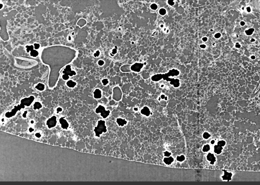
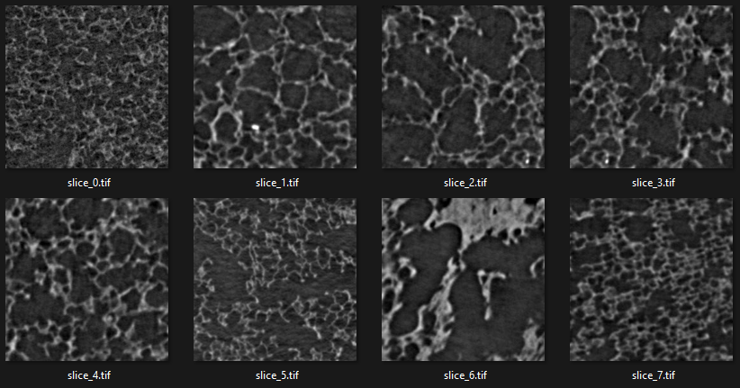
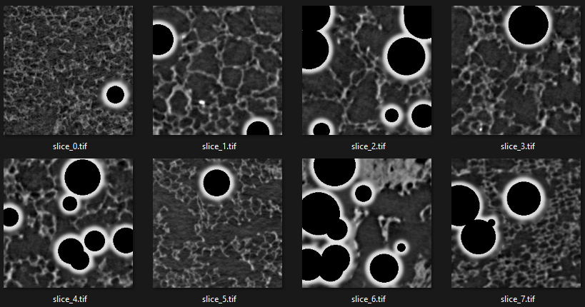
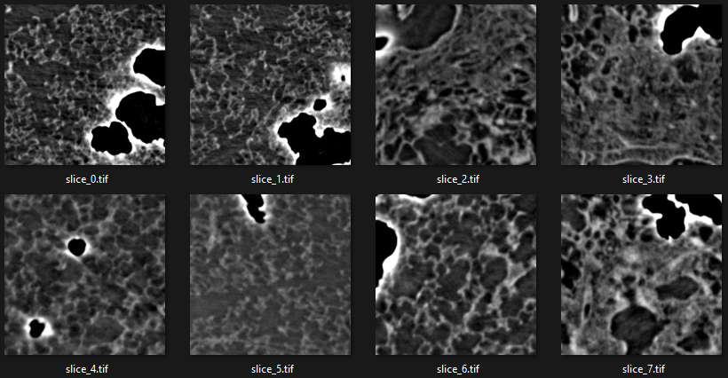
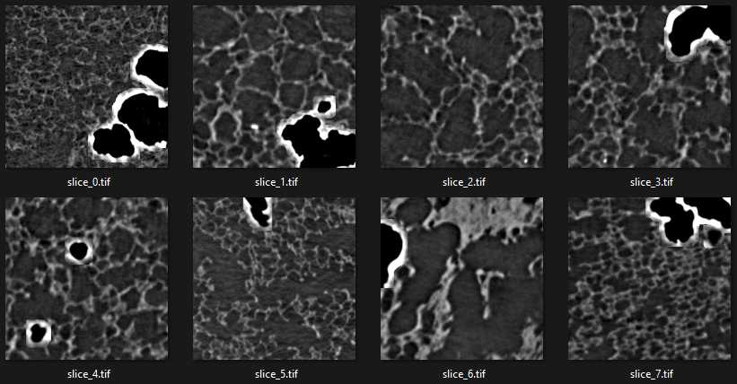
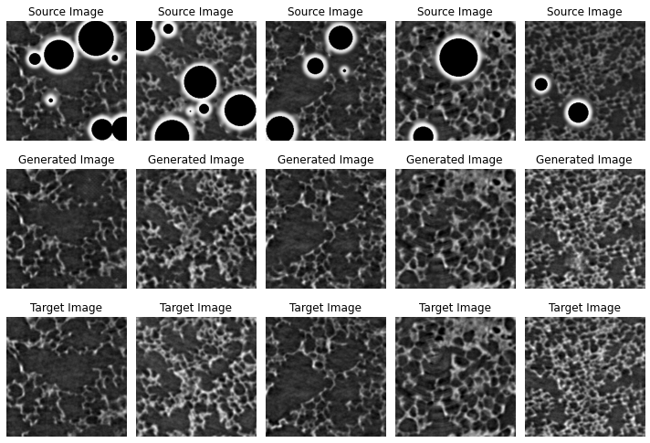

# AirGANs
Generative Adversarial Networks - GANs for the compensation of airbubbles in the micro-CT lung data.

## Air Bubbles
The classical process of preparing a Formalin Fixed Paraffin Embedded (FFPE) blocks for histoloy introduces airbubbles inside the sample. Although it causes no problem for classical histology staining slides, but for micro-ct scans in propagation based imaging in synchrotron source airbubbles is very problamatic. As we use the standard FFPE blocks for micro-CT scans these airbubbles creates problem for rendering and further data analysis. 

    

  A part of a slice of a sample scan with airbubbles inside

## Pix2Pix to remove airbubbles
The main idea is to use the conditional GANs for image transformation specifically pix2pix for compensate airbubble with synthetic structures.
To train a pix2pix network we need dataset which comes in a pair. So for each sample with airbubble we need corresponding pair with no airbubble. But it is not possible to know what can be inside the airbubble in the sample. So we need to find a way to create dataset which has pair.

## Data preprocessing

### 1. Synthetic Airbubbles
One idea is to introduce airbubbles artificially into a non airbubble sample to create a pair. The actual airbubble is somewhat circular and has a high contrast/bright boders with black pixels inside. I tried to mimic the same features to create the image pairs for training. 

|  |  |
|:---:|:---:|
| slices without airbubble | same slices with artificially introduced airbubbles |

### 2. Copy actual airbubble
Another idea is to identify the airbubbles in the sample and extract the airbubble and put it on a sample without airbubble to create a pair for training. 

|  |  |
|:---:|:---:|
| slices with real airbubble | real airbubbles transfered to non airbubble sample |

## Training pix2pix
After the data preprocessing with the synthetic air and actual air pairs a pix2pix model is trained with both the datasets. 

### 1. Training with synthetic air
The pix2pix model is trained for 30 epochs with a batch size of 1 and with 5500 sample paires. Figure below shows the result using the test source and target pairs with generated target images.

    

  Test Source Target pairs with generated images

